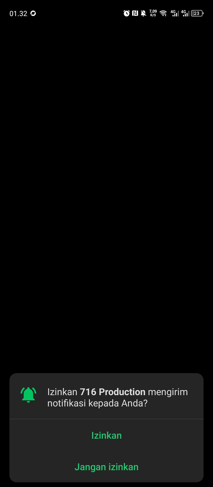
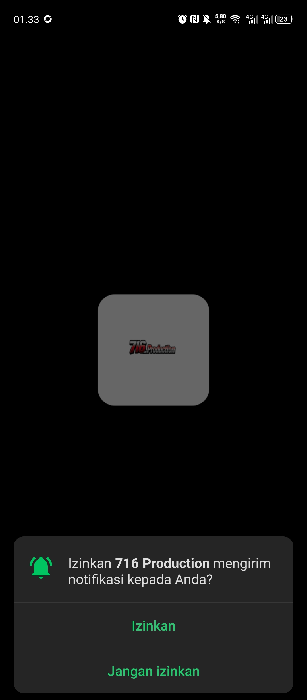
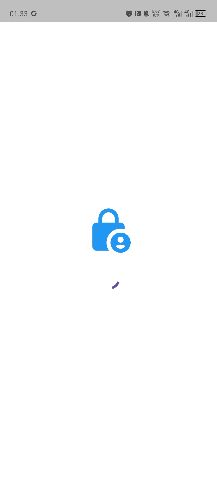
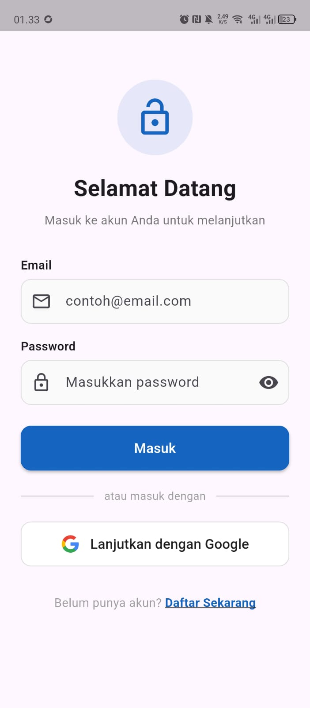
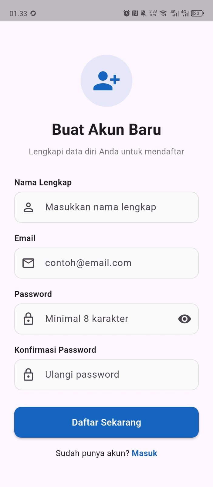
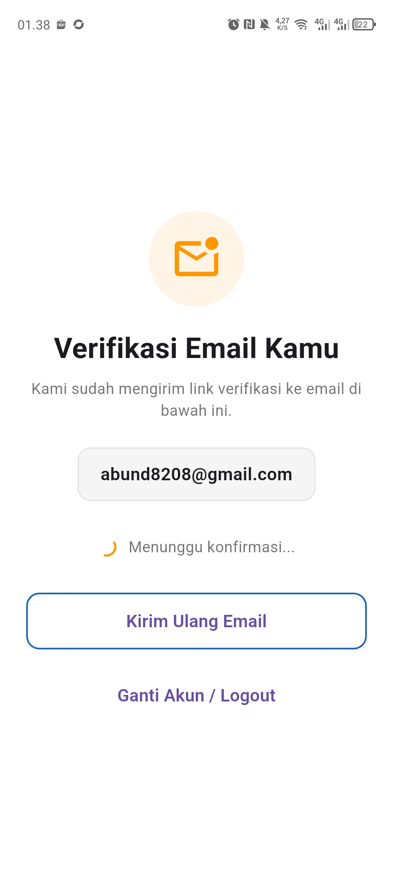
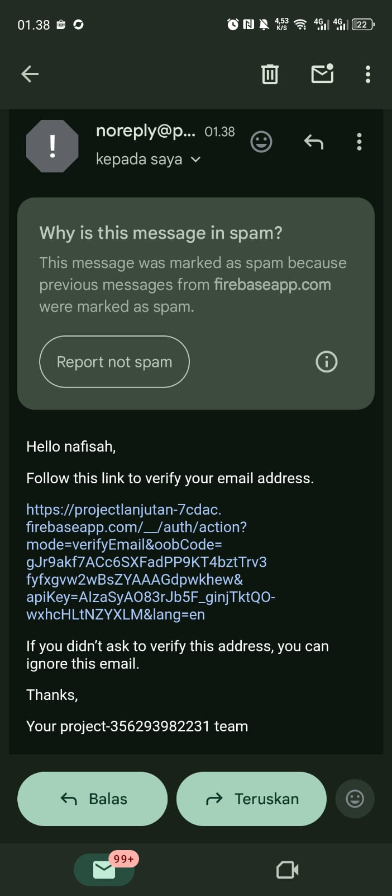
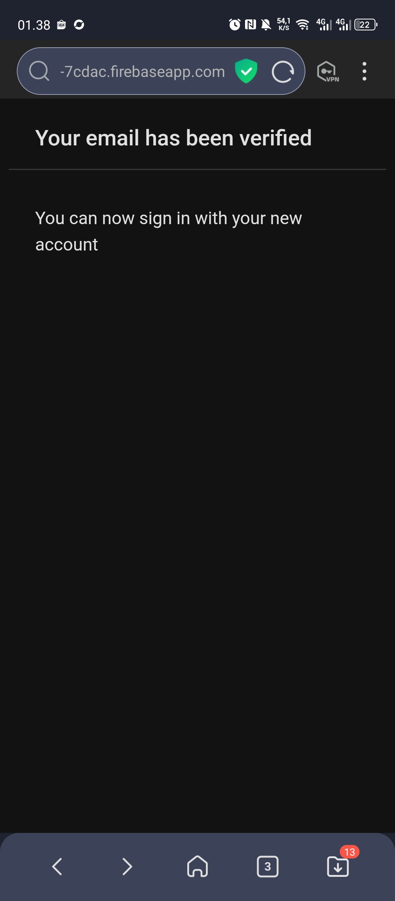
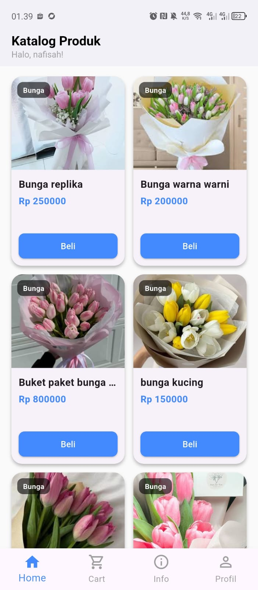

# UTS Pemerograman Mobile Lanjutan

# Pengembang
 * Muhamad Ayesha Aulia
 * 1123150188
 * TI SE SH 23
 * Teknik Informatika
 * Software Engineering

# Aplikasi E-commerce Toko Bunga 716_Production

## Tect Stack
Aplikasi ini di rancang dengan :

- [Flutter](https://docs.flutter.dev/get-started/learn-flutter) - Sebagai Front-End yg menerima respon dari beckend & Response User ke beckend
- [Firebase](https://firebase.google.com/?hl=id) - Sebagai Authentikasi Verifikasi email-validation dan log-in Google
- [Golang-beckend](https://github.com/muhamadayeshaaulia/semester6.4_Firebase_Authentication_Lanjutan.git) - sebagai backend API untuk menghubungkan Mysql ke Front-End
- [Mysql](https://www.apachefriends.org/download.html) - sebagai database local

# Tampilan UI untuk APlikasi ini

 * Tampilan ketika awal pertama kali aplikasi berjalan

  
  
  

 * Tampilan halaman Login register & email Verified
 

  
  
  

 * Setelah aplikasi mengirimkan aplikasi cek email & klik email untuk verified
  

  
  

 * Setelah email terverifikasi makan aplikasi langsung mengarahkan ke halaman dashboard
 

  

